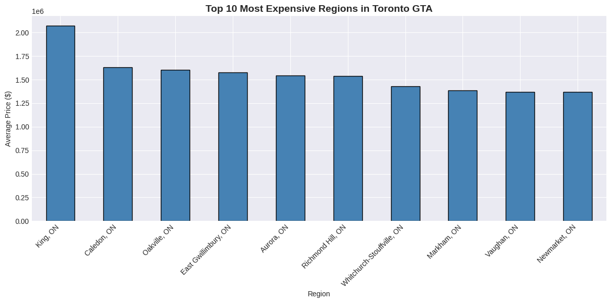
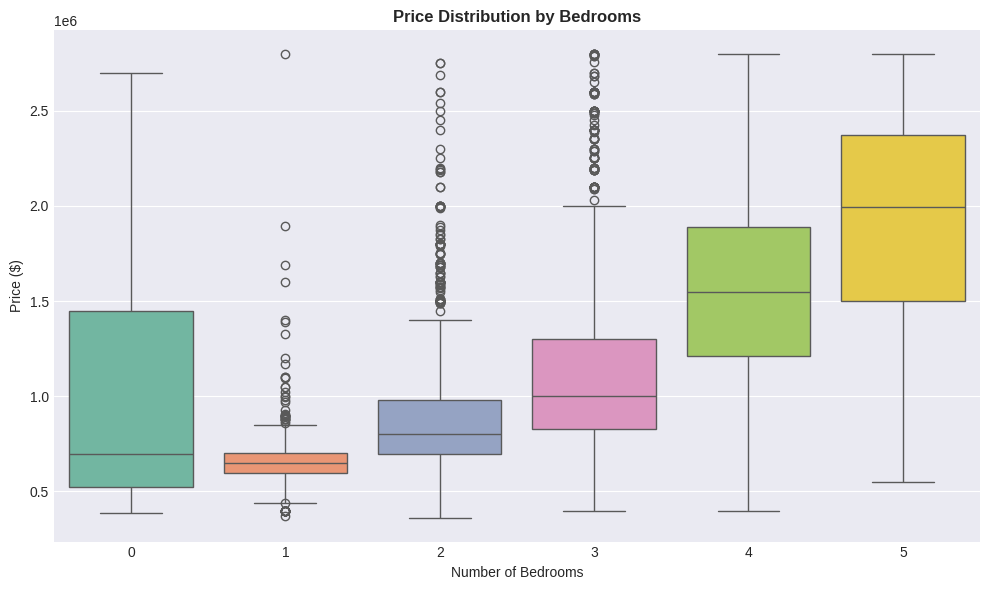
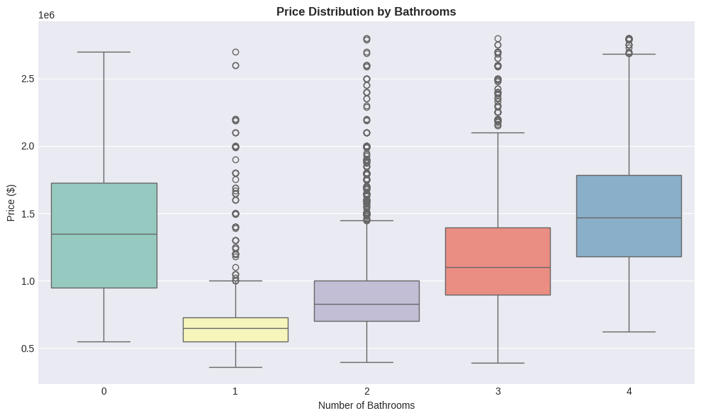
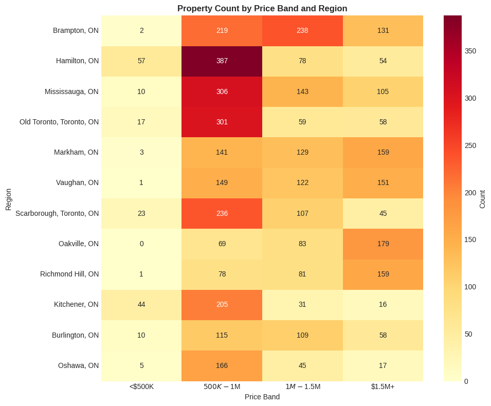

# Toronto (GTA) Real Estate Analysis (EDA + Visual Insights)

This project analyzes residential real estate listings in the **Greater Toronto Area (GTA)** to uncover **pricing trends**, **regional differences**, and **property feature impacts** (bedrooms, bathrooms) on home prices. The goal is to turn raw listings data into **clear, decision-ready insights** for buyers, investors, and analysts.

---

## Dataset Overview

- **Listings analyzed:** 6,801+ properties  
- **Regions covered:** 31 GTA regions  
- **Price range:** ~CAD 1K to CAD 55M (based on the dataset)  
- **Average price:** ~CAD 1.8M  
- **Key factors explored:** region, bedrooms, bathrooms, and price bands

> Note: The exact numbers may vary slightly depending on filtering/cleaning steps in the notebook.

---

## Key Questions Answered

1. How are prices distributed across GTA listings?
2. Which regions have the highest average prices?
3. How strongly do **bedrooms** and **bathrooms** correlate with listing price?
4. Which regions fall into high/medium/low price bands (heatmap view)?
5. What price patterns can guide **investment** or **buying decisions**?

---

## Key Findings
- **Market size**: 6,801 properties across 31 regions
- **Price range**: $359K - $2.8M (average: $1.18M)
- **Most expensive**: King, ON at $2.07M average
- **Market concentration**: 48% of properties are $500K-$1M
- **Bedroom impact**: 3-bedroom homes dominate (44% of market) at $1.1M average
- **Strong correlation**: Each additional bedroom adds ~$450K to average price

---

## Results Preview (Visuals)

All plots below are generated from the analysis and saved under `/assets`.

### 1) Price Distribution (Overall)
Shows the overall listing price spread and outliers.


### 2) Top 10 Regions by Average Price
Highlights premium regions based on average listing price.


### 3) Price vs Bedrooms (Boxplot)
Compares how listing price changes across bedroom counts.


### 4) Price vs Bathrooms (Boxplot)
Shows the relationship between number of bathrooms and listing price.


### 5) Price Band Heatmap by Region
A region-wise heatmap grouping areas into price bands for quick comparison.


---

## Notebook

Main analysis notebook:
- `analysis.ipynb`

Recommended rename (optional, more professional):
- `toronto_gta_real_estate_analysis.ipynb`

---

## How to Run Locally

### 1) Install dependencies
```bash
pip install -r requirements.txt
